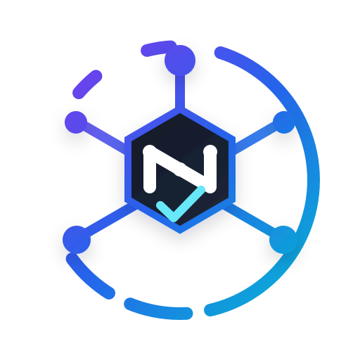
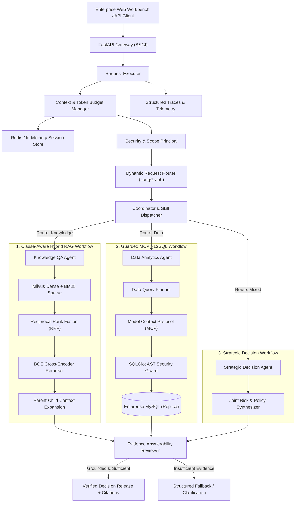
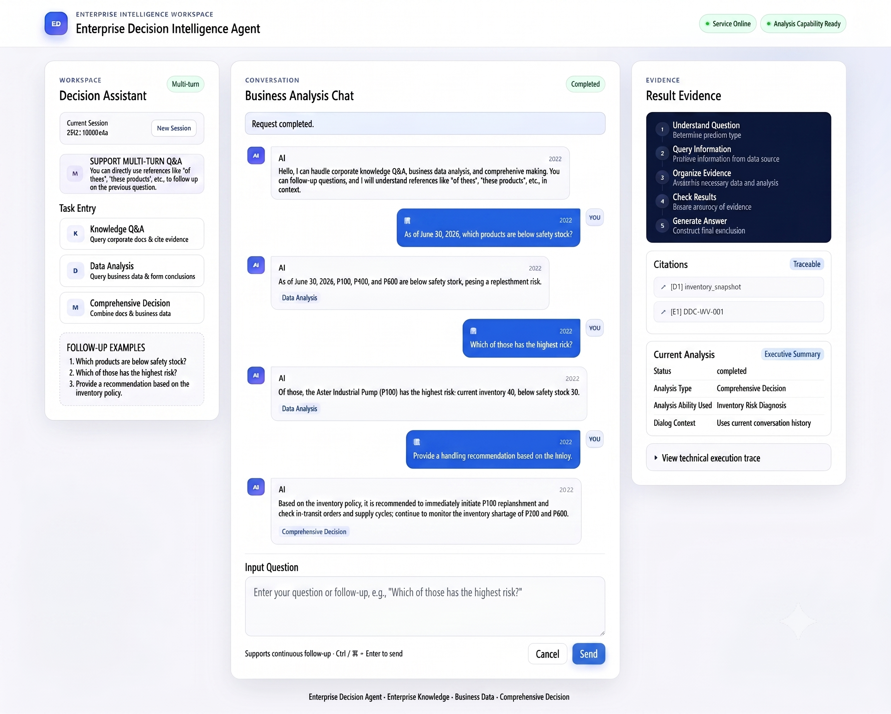

<div align="center">



# ⚡ NexusAgent: Enterprise Autonomous Multi-Agent Decision Intelligence Platform

### *Deterministic Evidence-Grounded Hybrid RAG × Model Context Protocol (MCP) NL2SQL × LangGraph Multi-Agent Orchestration*

<p align="center">
  <a href="#system-architecture"></a>
  <a href="#mcp-data-agent--safe-nl2sql"></a>
  <a href="#clause-aware-hybrid-rag-pipeline"></a>
  <a href="#clause-aware-hybrid-rag-pipeline"></a>
  <br />
  <a href="#mcp-data-agent--safe-nl2sql"></a>
  <a href="#distributed-tracing--context-management"></a>
  <a href="#production-asgi-runtime"></a>
  <a href="#engineering-rigor--ci-pipeline"></a>
  <a href="#license"></a>
</p>

**[Key Features](#key-engineering-highlights)** • **[System Architecture](#system-architecture)** • **[Web Workbench](#interactive-web-analytics-workbench)** • **[Hybrid RAG](#clause-aware-hybrid-rag-pipeline)** • **[MCP NL2SQL](#mcp-data-agent--safe-nl2sql)** • **[Benchmarks](#retrieval-benchmark-v2-results)** • **[Quickstart](#local-quickstart)**

---

</div>

## 📌 Executive Summary & Problem Solved

Modern enterprise decision-making is severely bottlenecked by **data fragmentation**. High-stakes operational scenarios—such as supply chain inventory replenishment, pricing and discount authority audits, warranty validation, and financial risk assessment—require simultaneously cross-referencing **unstructured compliance policies** with **live relational databases**.

Traditional LLM chatbots and naive vector search (RAG) fail catastrophically in production:
1. **Hallucination over Fine Print**: Generic vector chunks sever clause hierarchies, losing critical exception conditions.
2. **Schema Hallucinations & Blind SQL Injection**: Naive text-to-SQL lacks schema sandboxing, execution timeouts, and AST-level query validation.
3. **Absence of Grounded Verifiability**: Decisions lack verifiable citations mapping claims to official document clauses and live database rows.
4. **Context Drift in Multi-Turn Dialogues**: Unbounded token accumulation degrades reasoning and leaks cross-tenant state.

**NexusAgent** is an enterprise-grade, autonomous multi-agent platform that resolves these bottlenecks. Utilizing **LangGraph state machine orchestration**, the **Model Context Protocol (MCP)** for secure tool execution, a **Clause-Aware Hybrid RAG engine (Milvus + BM25 + BGE Reranker)**, and an automated **Evidence Answerability Reviewer**, the platform delivers audited, zero-hallucination decision recommendations backed by exact evidence citations (`[E1]`, `[D1]`).

---

## 🛠️ Advanced Tech Stack & Architecture

| Tier | Technologies & Components | Production Responsibilities |
| :--- | :--- | :--- |
| **Agent Orchestration** | **LangGraph**, LangChain Core, Pydantic v2 | Stateful Multi-Agent execution graphs (`Supervisor Router → Planner → Skills → Tools → Reviewer`) with strict schema contracts |
| **Tool Execution Layer** | **Model Context Protocol (MCP)**, Native Tool Calling | Standardized, sandboxed tool interfaces for live enterprise schema inspection and query dispatching |
| **Vector & Dense Retrieval** | **Milvus Vector DB** (HNSW Cosine), BAAI `bge-small-zh-v1.5` | High-dimensional semantic dense vector search across hierarchically indexed enterprise clauses |
| **Lexical & Reranking** | **BM25 Sparse Search**, Reciprocal Rank Fusion (**RRF**), BAAI `bge-reranker-base` | Cross-encoder precision reranking combining lexical keyword accuracy with semantic embeddings |
| **Deterministic NL2SQL** | **SQLGlot AST Parser**, SQLAlchemy, PyMySQL | Natural language to SQL translation with AST allowlisting, read-only validation, forced `LIMIT` injection, and query sandboxing |
| **State & Session Memory** | **Redis 7.0+**, In-Memory State Store | Multi-tier session isolation, rolling window summarization, TTL lifecycle management, and token budget enforcement |
| **Serving & Infrastructure** | **FastAPI ASGI**, Uvicorn, Docker Compose | Async high-throughput REST endpoints, structured OpenTelemetry-compatible tracing, and containerized deployment |

---

## 🏛️ System Architecture



---

## 🚀 Key Engineering Highlights

```
                 ┌────────────────────────────────────────────────────────┐
                 │       LangGraph Multi-Agent State Machine Orchestration│
                 └───────────────────────────┬────────────────────────────┘
                                             │
               ┌─────────────────────────────┴─────────────────────────────┐
               ▼                                                           ▼
┌───────────────────────────────┐                       ┌──────────────────────────────────┐
│   Clause-Aware Hybrid RAG     │                       │  Guarded MCP NL2SQL Engine       │
│ • Milvus HNSW Dense Vector    │                       │ • Anthropic MCP Server Standard  │
│ • BM25 Lexical Keyword Engine │                       │ • SQLGlot AST Syntax Allowlisting│
│ • Reciprocal Rank Fusion (RRF)│                       │ • Forced LIMIT & Timeout Guards  │
│ • BGE Cross-Encoder Reranker  │                       │ • Zero Data Leakage Scope Isolation│
│ • Parent/Child Chunk Expansion│                       │ • Deterministic Schema Discovery │
└──────────────┬────────────────┘                       └─────────────────┬────────────────┘
               │                                                          │
               └─────────────────────────────┬────────────────────────────┘
                                             ▼
                 ┌────────────────────────────────────────────────────────┐
                 │      Evidence Answerability Reviewer & Audit Trail     │
                 │      • Strict Citation Verification ([E1], [D1])       │
                 │      • Request-Level Distributed Tracing & Telemetry   │
                 └────────────────────────────────────────────────────────┘
```

### 1. Multi-Agent Orchestration via LangGraph
- Modular **StateGraph** coordinates transitions across `Supervisor Router → Planner → Domain Skills → Tools → Reviewer`.
- Type-safe Pydantic v2 state schemas eliminate runtime contract mismatches.
- Granular fail-closed logic ensures that partial agent failures trigger structured remediation rather than unhandled exceptions.

### 2. Clause-Aware Hybrid RAG (Milvus + BM25 + BGE Reranker)
- **Hierarchical Indexing**: Preserves stable clause markers (`Clause ID: {id}`) during chunking, maintaining parent-child document semantics.
- **Multi-Stage Ranking**: Merges Dense Vector recall (Milvus HNSW) and Sparse Lexical recall (BM25) via Reciprocal Rank Fusion (RRF), followed by BGE Cross-Encoder reranking.
- **Parent Expansion**: Compact Child chunks identify precise semantic hits, which are dynamically expanded to full Parent blocks to provide the LLM with complete contextual policies.

### 3. Model Context Protocol (MCP) & Safe NL2SQL
- **Standardized MCP Interface**: Integrates Anthropic Model Context Protocol tools for authorized schema discovery and guarded query execution.
- **AST Security Guardrails**: Every generated SQL query passes through SQLGlot AST parsing:
  - Enforces strict read-only guarantees (`SELECT` only; blocks `INSERT`, `UPDATE`, `DROP`, `ALTER`).
  - Restricts access to authorized table/column allowlists (`DataScope`).
  - Automatically injects query timeouts and forced `LIMIT` caps to prevent denial-of-service memory exhaustion.

### 4. Resilient Session Memory & Context Window Management
- Redis 7.0+ backed multi-tier memory supporting session isolation, TTL expiration, and cross-turn state versioning.
- Rolling window token budget manager automatically generates background summaries of historical turns when token thresholds are reached.

### 5. Evidence Sufficiency Review & Citation Verification
- Mandatory intermediate **Answerability Reviewer** audits selected evidence before answer release.
- Automatically refuses or requests clarification when policy documents lack required terms or when data results are incomplete.
- Enforces strict markdown citation syntax mapping every assertion directly to verified evidence spans (`[E1]`, `[D1]`).

---

## 🖥️ Interactive Web Analytics Workbench

<div align="center">
  
  <p><em>Figure 1: NexusAgent Interactive Web Workbench featuring multi-turn decision intelligence, live evidence inspection, execution path visualization, and live distributed trace telemetry.</em></p>
</div>

The Web Workbench provides enterprise users with a real-time operational interface:
- **Unified Multi-Turn Chat**: Natural language queries spanning knowledge QA, operational data questions, and joint diagnostic recommendations.
- **Live Execution Routing**: Visual indicators showing dynamic routing decisions (`Knowledge`, `Data`, `Mixed`).
- **Interactive Evidence Drawer**: Expandable side-panel displaying retrieved clause citations (`[E1]`), table schemas (`[D1]`), and similarity scores.
- **Distributed Trace Explorer**: Request-level telemetry showing per-stage latency breakdown across routing, retrieval, reranking, MCP tool execution, and answer synthesis.

---

## 📊 Retrieval Benchmark v2 Results

The retrieval pipeline is evaluated against **Retrieval Benchmark v2**, an offline frozen benchmark consisting of **200 enterprise scenarios** (160 answerable, 40 unanswerable) across 12 long-form corporate policies.

| Metric | RRF Baseline (Dense + Sparse) | BGE Cross-Encoder Reranker | Net Improvement |
| :--- | :---: | :---: | :---: |
| **Child Hit@1** | 85.62% *(137 / 160)* | **96.25%** *(154 / 160)* | **+10.63 pp** |
| **Child Hit@5** | 100.00% *(160 / 160)* | **100.00%** *(160 / 160)* | **100% Coverage** |
| **MRR@5** | 91.69% *(146.7 / 160)* | **98.12%** *(157.0 / 160)* | **+6.44 pp** |

> *Ranking metrics are calculated over the 160 answerable queries; the 40 unanswerable queries are audited for correct refusal and evidence insufficiency detection.*

---

## 🧪 Engineering Rigor & Quality Gates

```text
==================================== 100% Passing Test Suite ====================================
✓ 1,802 Unit Tests (State machines, prompts, AST guards, token budgets, serialization)
✓ 235 Stable Offline Integration Tests (Deterministic external-I/O substitutes, LangGraph graphs)
✓ 28 / 28 Security & Boundary Verification Tests (Tenant isolation, SQL injection prevention)
=================================================================================================
```

- **Zero-Network CI/CD Pipeline**: Full test suite runs entirely offline with deterministic mock providers and locked synthetic datasets.
- **Multi-Stage Quality Gates**: GitHub Actions executes `ruff` formatting/linting, `pydantic` strict typing, `pytest` async execution, and `pip-audit` vulnerability scanning on every PR.
- **Deterministic Evaluation Verifiers**: Standalone verification scripts validate locked artifact hashes and compute retrieval metrics without non-deterministic cloud provider dependencies.

---

## ⚡ Local Quickstart

### Option A: Instant Offline Verification (No External Keys Required)

Verify benchmark metrics, AST guardrails, and unit suites locally in under 30 seconds:

```bash
# 1. Clone repository
git clone https://github.com/your-org/enterprise-decision-agent.git
cd enterprise-decision-agent

# 2. Set up virtual environment
python3 -m venv .venv
source .venv/bin/activate  # On Windows: .venv\Scripts\Activate.ps1

# 3. Install core package
pip install -e . --no-deps

# 4. Run retrieval benchmark verification
python3 scripts/verify_retrieval_v2_evidence.py
```

### Option B: Full Runtime with Docker Infrastructure

Launch the full stack with containerized MySQL, Milvus vector database, and Redis session memory:

```bash
# 1. Start local infrastructure services
docker compose up -d

# 2. Configure environment
cp .env.example .env
# Edit .env to set your DECISION_AGENT_LLM_API_KEY and model endpoints

# 3. Run interactive CLI demo tasks
python3 scripts/run_local_demo.py knowledge
python3 scripts/run_local_demo.py data
python3 scripts/run_local_demo.py mixed

# 4. Launch the Interactive Web Analytics Workbench
python3 scripts/run_local_web_demo.py mixed
```

Access the Web Workbench interface at **`http://127.0.0.1:8000`**.

---

## 📂 Repository Structure

```text
├── src/decision_agent/          # Core Agent Platform Source
│   ├── agents/                  # LangGraph planners, selectors, and reviewers
│   ├── config/                  # Pydantic v2 settings & environment configuration
│   ├── data/                    # Business semantics & metadata registries
│   ├── ingestion/               # Markdown/PDF parsers & clause-aware chunkers
│   ├── retrieval/               # Milvus vector store, BM25, RRF, and BGE reranker
│   ├── security/                # Scope validators, token budgets, and audit logging
│   ├── skills/                  # Domain decision skills (inventory diagnosis, policy QA)
│   ├── tool_calling/            # Model Context Protocol (MCP) clients & SQLGlot guards
│   ├── web/                     # Interactive Web Analytics Workbench (HTML/JS)
│   └── workflows/               # LangGraph multi-agent execution graphs
├── datasets/                    # Sanitized enterprise datasets, schemas & fixtures
├── docs/                        # In-depth architectural and engineering documentation
├── docker/                      # Docker Compose & MySQL initialization scripts
├── scripts/                     # CLI runners, evaluation harnesses & verification tools
├── tests/                       # Unit, offline integration, and e2e test suites
└── LICENSE                      # Apache License 2.0
```

---

## 📖 Deep-Dive Documentation Sitemap

For comprehensive architectural design decisions, see the specialized technical guides:

- **[System Architecture](docs/ARCHITECTURE.md)** — In-depth component topology, state transitions, and data pipelines.
- **[Agent Workflow Orchestration](docs/AGENT_WORKFLOW.md)** — State machine coordination across Router, Planner, Skills, Tools, and Reviewer.
- **[Clause-Aware Hybrid RAG](docs/HYBRID_RAG.md)** — Detailed analysis of dense/sparse retrieval, RRF fusion, and Parent-Child expansion.
- **[MCP Data Agent & NL2SQL](docs/DATA_AGENT_AND_MCP.md)** — Model Context Protocol architecture, SQLGlot AST validation, and MySQL security.
- **[Security Boundaries & Scoping](docs/SECURITY_BOUNDARIES.md)** — Tenancy isolation, `DataScope`, `KnowledgeScope`, and zero-hallucination audits.
- **[Evaluation & Benchmarks](docs/EVALUATION.md)** — Retrieval Benchmark v2 methodology, metrics calculations, and regression testing.
- **[Local Run & Demo Guide](docs/LOCAL_DEMO.md)** — Step-by-step setup for CLI runners and Web Workbench deployment.
- **[Engineering Decisions & Roadmap](docs/ENGINEERING_DECISIONS.md)** — Technical trade-offs, architecture choices, and forward-looking roadmap.

---

## 📜 License

This project is licensed under the **Apache License 2.0** - see the [LICENSE](LICENSE) file for details.
