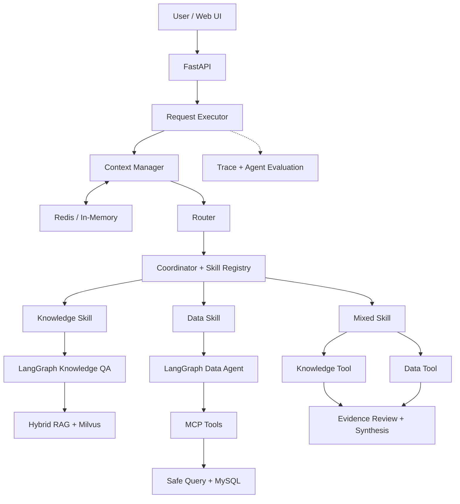

# Overall Architecture

Enterprise Decision Agent is composed of FastAPI, Context Manager, Router, Coordinator, Skill Registry, Knowledge / Data Tools, Reviewer, and Trace subsystems.

## Core Module Responsibilities

| Module | Key Responsibility |
| --- | --- |
| FastAPI | Provides health checks, readiness probes, and agent execution API endpoints |
| FormalRequestExecutor | Orchestrates request lifecycle: context assembly, routing, execution, review, and response emission |
| Router | Classifies requests into Knowledge, Data, or Mixed categories |
| Coordinator / Skill Registry | Dispatches registered Skills based on classified route |
| Native Tool Calling | Discovers and invokes Knowledge Agent or Data Agent tools |
| Reviewer | Audits execution outcomes, Evidence sufficiency, and Citations |
| Context / Memory | Assembles current request context and multi-turn session history |
| Trace / Offline Evaluation | Records execution stage spans and supports reproducible regression benchmarks |

## Knowledge QA Pipeline

The Knowledge pipeline loads versioned Parent/Child chunks, executes concurrent Dense and BM25 retrieval, fuses rank lists via Reciprocal Rank Fusion (RRF), refines candidates via Cross-Encoder reranking, and restores complete context through Parent Expansion. Subsequently, Evidence Selection, Answerability Review, grounded answer generation, and strict citation validation are performed.

## Data Analysis Pipeline

The Data pipeline executes via Native Tool Calling to the Data Agent. The Data Agent first queries the MCP server for authorized schemas and business definitions, generates structured SQL query plans via the Data Planner, executes guarded queries against MySQL through MCP, and synthesizes data-grounded answers with citations.

## Joint Decision Pipeline

The Mixed pipeline orchestrates both Knowledge and Data subtasks, combining policy rules and operational metrics into a unified inventory risk diagnosis with policy citations and data evidence, followed by final review.

## Runtime Resources

MySQL, Milvus, Redis, and MCP client sessions are initialized during application startup and cleanly finalized upon application shutdown. Unit test suites use deterministic in-memory stubs, while integration and production runtimes connect via Docker and environment configurations.
